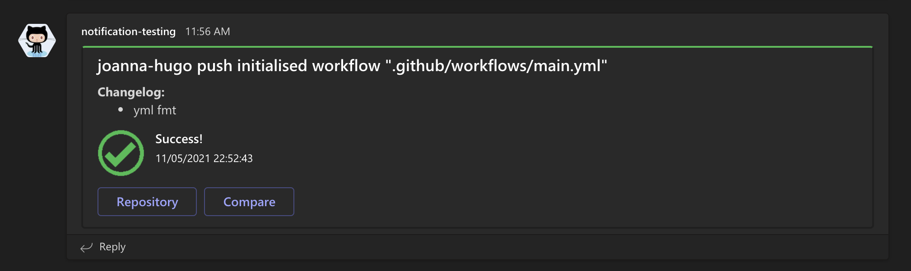
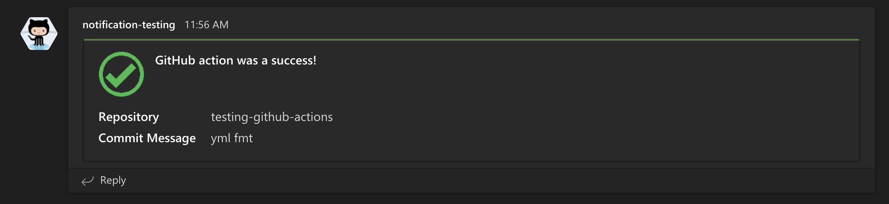

# Teams Notification
This GitHub Action sends a notification to Teams saying if the pipeline was successful or not.
This GitHub action can be part of existing GitHub action pipelines.

# Usage
Checkout the "usage.yml" file to see exactly how you would use this action.
This action has 2 formats, the "v1" tag and the "test" tag. The "v1" tag results in a message with
links to the repository and a page comparing the changes in the most recent commit.
The "test" tag results in a message with information about the repo but no links

Create an incoming webhook in teams, following [these instructions](https://docs.microsoft.com/en-us/microsoftteams/platform/webhooks-and-connectors/how-to/add-incoming-webhook#create-incoming-webhook-1), be sure to save the URL.
Create a GitHub secret `MS_TEAMS_WEBHOOK_URL` and set the value to the URL of your new incoming webhook.
This determines where the notification will be sent

# Results
This is what the "v1" tag message looks like

This is what the "test" tag message looks like

