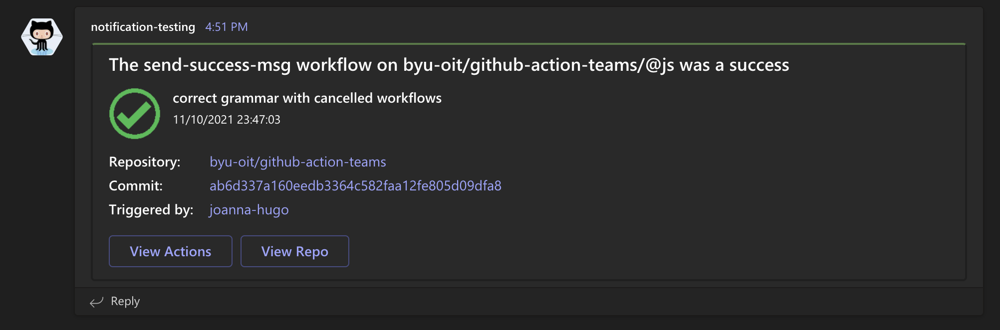
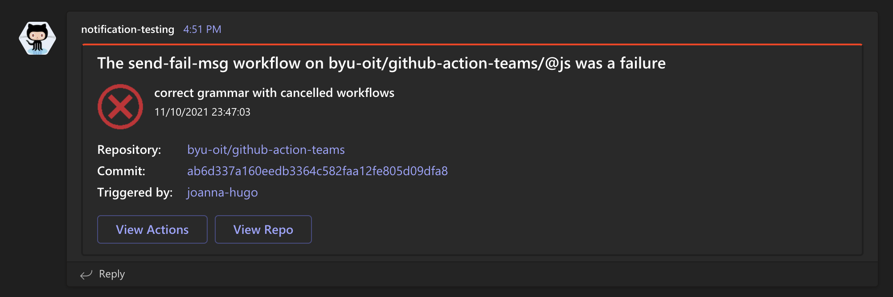

#  github-action-teams

# Teams Notification
This GitHub Action sends a notification to Teams saying if the GitHub Actions Job was successful or not.
This GitHub action can be part of existing GitHub action pipelines. This action is meant to mirror [github-action-slack](https://github.com/byu-oit/github-action-slack)

# Usage
Checkout the "usage.yml" file to see exactly how you would use this action.

Create an incoming webhook in teams, following [these instructions](https://docs.microsoft.com/en-us/microsoftteams/platform/webhooks-and-connectors/how-to/add-incoming-webhook#create-incoming-webhook-1), be sure to save the URL.
Create a GitHub secret `MS_TEAMS_WEBHOOK_URL` and set the value to the URL of your new incoming webhook.
This determines where the notification will be sent. Consider sending test notifications to `Application Engineering > notification-testing` during development.

The step will need an ID, which shows up in the title of the card notification (The <ID> workflow...)
The tag (`@js` in the examples) is the name of the branch or tag that the event came from.

# Results
This is what the success message looks like

This is what the failure message looks like

# Notes
The GitHub actions currently say the Test action is failing. This is by design in order to test sending a fail notification.
